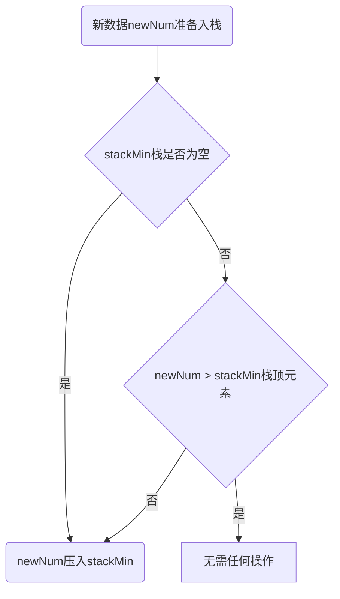

# 设计一个具有getMin功能的栈

## 题目描述

实现一个特殊的栈,在实现栈的基本功能的基础上,增加返回栈中最小元素的操作

## 要求

pop、push、getMin时间复杂度为O(1)

## 算法思路

设计上，使用 **两个栈**，一个就是普通的栈，用来保存当前栈中元素，标记为stackData.

另一个栈用于保存每一步栈操作之后的最小值，标记为stackMin

使用双栈操作,以达到 getMin时间复杂度也为O(1) 的效果

### 压入数据规则

假设当前要入栈数据为 newNum, 则算法流程图如下:

**方案流程图**


- 将number压入stackData
- 判断stack是否为空，若为空，newNum也压入stackMin
- stackMin不为空, 比较numNum与stackMin栈顶元素比较
- 如果 numNum 小于stackMin栈顶元素，newNum也压入stackMin，否则不做任何操作

### 弹出数据规则

- stackData 为空,抛出异常
- stackData 不为空, 弹出栈顶元素, 记为 topValue
- 如果topValue小于stackMin栈顶元素,弹出stackMin栈顶元素

### 获取栈中最小值操作

- 数据入栈出栈操作逻辑操作，决定stackMin栈顶元素即为栈中最小值

### 代码实现

```go
package main

import "errors"

type StackInterface interface {
	Pop() (int, error)
	Push(pushVal int)
	GetMin() (int, error)
	IsEmpty() bool
}

func NewStack() *Stack {
	return &Stack{
		data: make([]int, 0),
		min:  make([]int, 0),
	}
}

type Stack struct {
	data []int
	min []int
}

func (one *Stack) IsEmpty() bool {
	return len(one.data) ==0
}

func (one *Stack) Push(pushValue int) {
	one.data = append(one.data, pushValue)
	if len(one.min) == 0 {
		one.min = append(one.min, pushValue)
	} else {
		if one.min[len(one.min) - 1] > pushValue {
			one.min = append(one.min, pushValue)
		}
	}
}

func (one *Stack) Pop() (int, error) {
	if one.IsEmpty() {
		return 0, errors.New("栈为空")
	}
	topVal := one.data[len(one.data) - 1]
	one.data = one.data[:len(one.data) - 1]
	if one.min[len(one.min) - 1] > topVal {
		one.min = one.min[:len(one.min) - 1]
	}
	return topVal, nil
}

func (one *Stack) GetMin() (int, error) {
	if len(one.min) == 0 {
		return 0, errors.New("栈为空")
	}
	return one.min[len(one.min) - 1], nil
}

```

<script>
var pageId = "设计一个具有getMin功能的栈"
</script>

!INCLUDE "../../common/gitalk.html"
